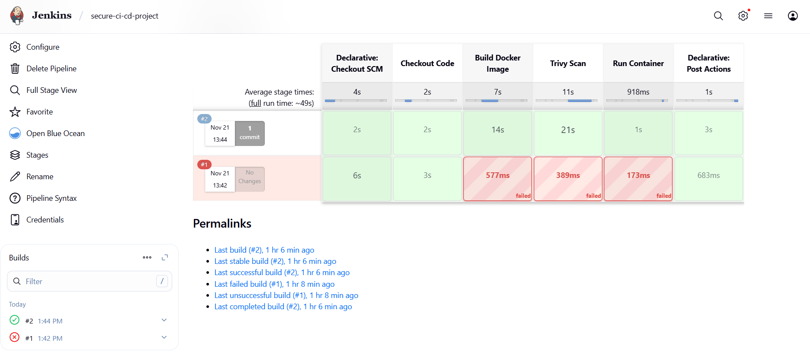
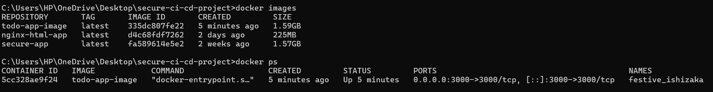
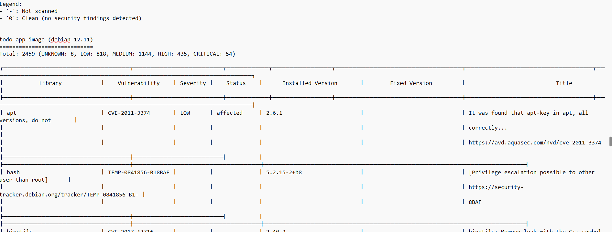

# 🔐 Secure CI/CD Pipeline for To-Do List Application  
A complete DevSecOps project implementing Continuous Integration, Continuous Delivery, Containerization, Vulnerability Scanning, and Automated Deployment using Jenkins, Docker, WSL, and Trivy.

---

## 🚀 Project Overview

This project demonstrates the implementation of a **Secure CI/CD pipeline** for a Node.js-based To-Do application.  
The pipeline automates:

- Code retrieval from GitHub  
- Docker image build  
- Vulnerability scanning using Trivy  
- Container deployment using Docker  
- Continuous Integration & Delivery using Jenkins  

The workflow ensures **secure, fast, and automated delivery** of the application.

---

## 🧩 Tech Stack

| Category | Tools |
|---------|-------|
| Version Control | Git, GitHub |
| CI/CD | Jenkins |
| Containerization | Docker |
| Security | Trivy |
| Backend | Node.js, Express |
| Frontend | HTML, CSS, JS |
| Environment | WSL Ubuntu |

---

## 🏗️ Architecture Diagram

(Add your diagram image here — `docs/architecture.png`)

```
Developer → GitHub → Jenkins → Docker Build → Trivy Scan → Deploy → User
```

---

## 🔄 CI/CD Pipeline Flow

### **Stage 1 – SCM Checkout**
Fetches code from GitHub (main branch)

### **Stage 2 – Build**
Builds Docker image using Dockerfile

### **Stage 3 – Security Scan**
Trivy scans the built Docker image

### **Stage 4 – Deployment**
Deploys secure container on port 3000

### **Stage 5 – Cleanup**
Removes unused images & containers

---

## 📁 Folder Structure

```
secure-ci-cd-project/
│
├── app/
│   ├── server.js
│   ├── package.json
│   └── public/
│
├── docker/
│   └── Dockerfile
│
├── jenkins/
│   └── Jenkinsfile
│
├── reports/
│   └── trivy-report.txt
│
├── docs/
│   ├── architecture.png
│   └── screenshots/
│
└── README.md
```

---

## 📦 Docker Commands

### Build Image
```
docker build -t todo-app-image .
```

### Run Container
```
docker run -d -p 3000:3000 --name todo-container todo-app-image
```

---

## 🔐 Trivy Scan Command

```
trivy image todo-app-image
```

Output saved in:
```
reports/trivy-report.txt
```

---

## ⚙️ Jenkins Pipeline

Pipeline includes:  
- GitHub SCM  
- Docker build  
- Trivy scan  
- Deploy container  
- Console logs  

(Jenkinsfile kept inside `/jenkins/`)

---

## 🌐 Access Application

```
http://localhost:3000
```

---

---

## 📸 Screenshots

### **1️⃣ Jenkins Pipeline Running**



### **3️⃣ Docker Images List**


### **4️⃣ Running Docker Containers**


### **5️⃣ Trivy Vulnerability Scan Output**


### **6️⃣ Application Running on Browser**


---


## 🔮 Future Improvements

- Kubernetes (EKS/Minikube)  
- SonarQube integration  
- Slack/Email notifications  
- Automated tests  
- DockerHub/ECR image pushing  

---

## 👥 Team Members

```
AYUSH RAWAT  
NAMIT RAMPAL  
ANUJ NEGI  
DEVANK SILSWAL  
SATYAM SINGH  
SHIVAM KUMAR
```

---

## 📚 References

- Jenkins Documentation  
- Docker Documentation  
- Trivy by Aqua Security  
- Node.js Docs  
- GitHub Docs  

